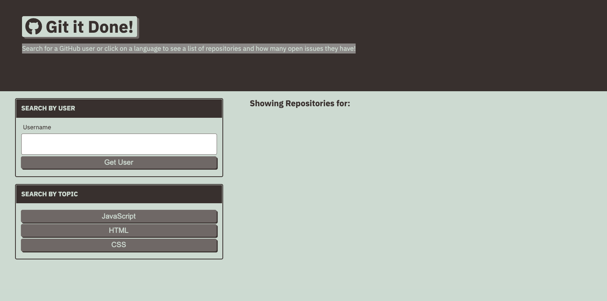

# MyRepo

## Table of Contents

- [Description](#description)
- [Installation](#installation)
- [Tools](#tools)
- [Contact](#contact)
- [License](#license)
- [Acknowledgements](#acknowledgements)

## Description

An application that searches for a GitHub user and/ or display a list of repositories by language (HTML, CSS, JavaScript) results from the GitHub API. 

## Installation

- Clone the repo (please reference the links below).

```md
git@github.com:Kimberly-Rodriguez/MyRepo.git
```



[Application-Link](https://kimberly-rodriguez.github.io/MyRepo/)

## Tools

This application was built using JavaScript with methods like `split()`, `pop()`and `join()` to revise, remove or connect values critical to the data being requested. 

[GitHub API documentation](https://docs.github.com/en/rest/overview/resources-in-the-rest-api)

## Contact

If you have any questions about my work OR wish to collaborate in the future please contact me via email: krodriguez.ucla@gmail.com OR feel free to connect via GitHub: [Kimberly-Rodriguez](https://github.com/Kimberly-Rodriguez).

## License

Licensed under the [MIT License](LICENSE).

## Acknowledgements

[UCLA Extension Coding Bootcamp](https://bootcamp.uclaextension.edu/coding/)
